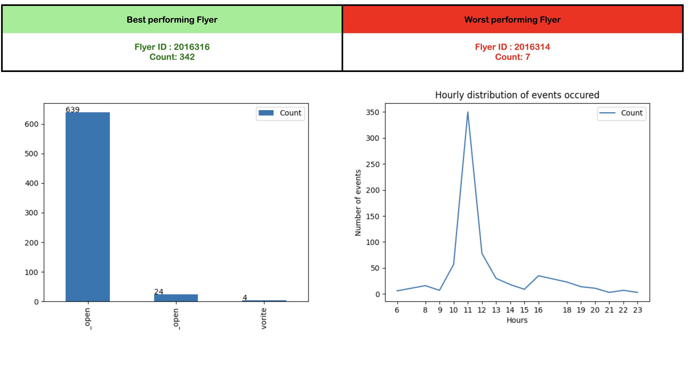

# Solution

### Task 1: 

1. Compute the average time on flyer per user.
- The solution for this is written in 2 files: `calculate_average_time_per_user.py` and `Calculate Average Time Per User.ipynb`. The jupyter notebbok has a detailed explanation of the approach as well as the code and, the python file only has the main logic written in a function

2. Next, generate an output that will back a Business Intelligence (Bl) report that will be shared with our merchant partners.

- I have created an analytics module as well as reporting module that generates analysis and creates and generates an html report that can be shared with the merchants.

The reporting and analysis logic is written at `reporting/`. To run the module, follow the following steps:

```python

python3 -m venv .venv

source .venv/bin/activate

pip install -r reqirements.txt

python3 main.py
```
After running the above set of commands the reports will be generated in `output/` location which can then be viewed in a browser:




### Task 2: Infrastructure

For the part 2 of the exercise, I have created a `System Design.docx` which has the system design outlined with explanation for each problem asked in the second task 

